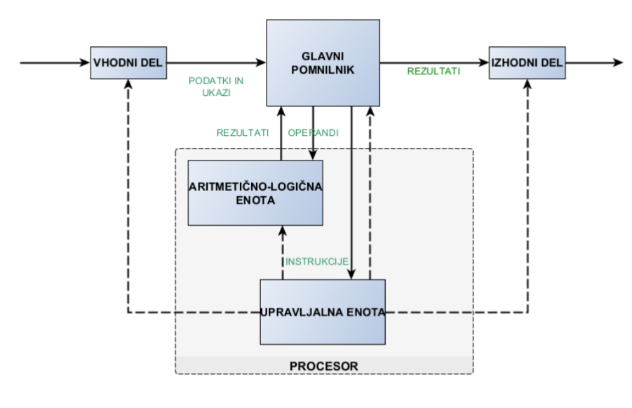
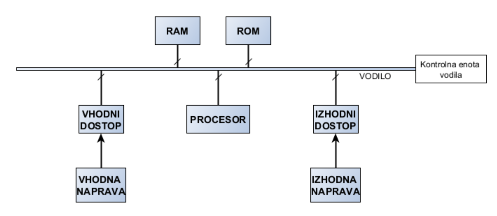

# Sodobni Računalniški Sistemi

Sodobni računalniški sistemi še vedno temeljijo na konceptualnem modelu računalnika, ki ga je leta 1945 opisal **John von Neumann**.

## Model von Neumanna
Po modelu von Neumanna ima vsak računalnik naslednje dele:
- **Vhodni del**
- **Izhodni del**
- **Delovni ali glavni pomnilnik**
- **Aritmetično-logična enota**
- **Upravljalna enota**

### Funkcijski Model Računalnika

---

### Opis Posameznih Delov
1. **Vhodni del**  
   Preko vhodnega dela iz okolja vnašamo podatke ter ukaze iz programa.

2. **Izhodni del**  
   Preko izhodnega dela v okolje prenašamo rezultate izvajanja programa.

3. **Delovni ali glavni pomnilnik**  
   Uporabljamo ga za hrambo vseh podatkov ter ukazov iz programa, ki so vnešeni od zunaj, ter za hrambo rezultatov izvajanja programa.

4. **Aritmetično-logična enota**  
   Izvaja aritmetično-logične operacije, ki so določene s strani ukazov.

5. **Upravljalna enota**  
   - Prejema ukaze iz pomnilnika, izvaja dekodiranje ukazov in na osnovi tega upravlja z aritmetično-logično enoto ter z vhodnim in izhodnim delom.
   - V sodobnih sistemih sta aritmetično-logična enota ter upravljalna enota združeni v procesorju, ki dodatno vsebuje še množico registrov.

---

## Vodilo (Bus)

### Vodilo (1)

- Iz funkcijske sheme von Neumannovega računalnika vidimo, da so posamezni deli med seboj povezani.
  - Vsaka povezava, ki predstavlja tok podatkov, ukazov ali upravljalnih signalov, je sestavljena iz večjega števila linij, ki tvorijo vodilo.
- Posamezne enote so povezane preko vodila (ang. bus):
  - Prenos električnih signalov v obliki bitov.
  - Za prenos vsakega bita potrebujemo eno linijo vodila.
  - Vsaka povezava v funkcijskem modelu se nanaša na prenos določenega števila bitov.
  - Medsebojno direktno povezovanje vseh posameznih delov računalnika je nesmiselno.
  - Zato je ustvarjeno vodilo, na katerega so priklopljeni vsi posamezni deli računalnika.
  - Z vodilom upravlja ločena upravljalska enota.

---

### Vodilo (2)
- Vsa izmenjava podatkov, ukazov ter kontrolnih signalov se izvaja preko skupnega vodila.
- Preko skupnega vodila se v enem trenutku izvaja samo en prenos:
  - Za dober izkoristek povezave se prenosi ustvarjajo v določenem časovnem intervalu.
  - **Deljeni čas na vodilu** (ang. time share).

---

### Vodilo (3)
- **Časovna rezina na vodilu** (ang. bus time slot):
  - V eni časovni rezini, ki traja \(T_B\) sekund, lahko ustvarimo samo en prenos.
  - Npr. vodilo, ki ima časovno rezino \(T_B = 100ns\), omogoča, da imamo v 1 sekundi 10 milijonov prenosov.
  - Če lahko v eni rezini prenesemo 1 B, to pomeni, da se preko vodila lahko prenese 10 MB podatkov.