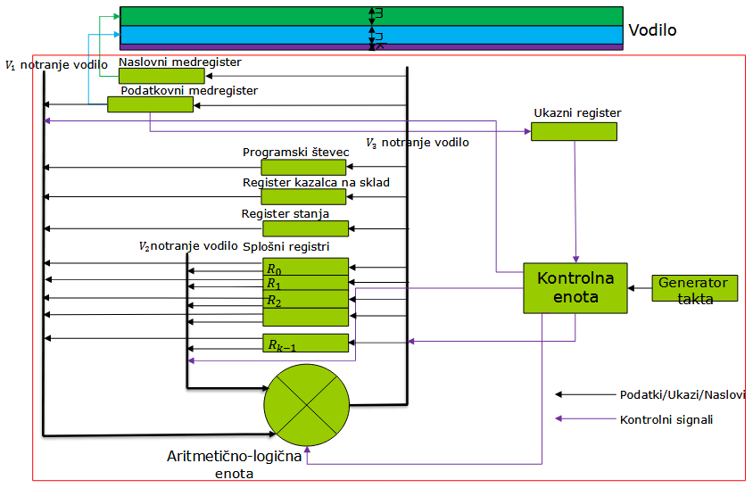
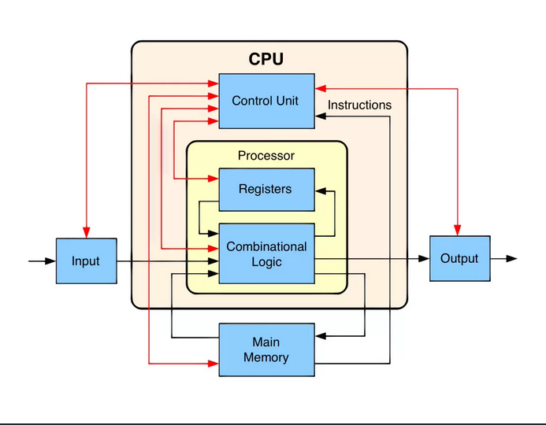
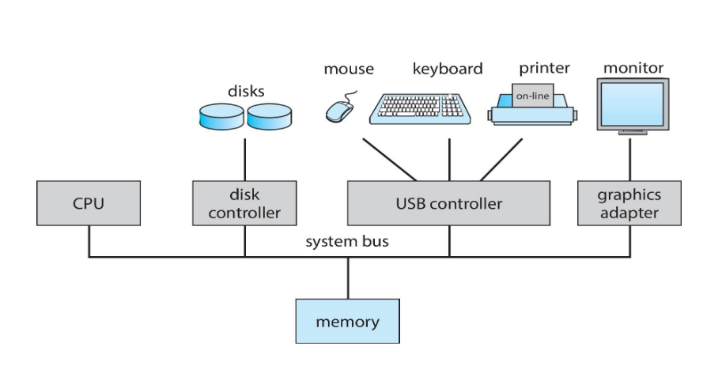
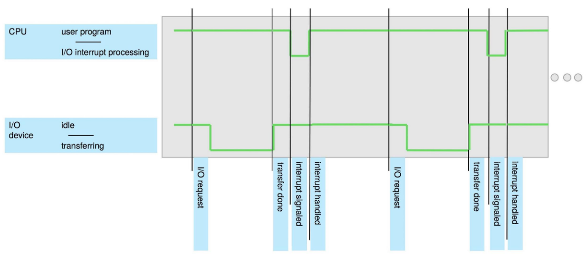
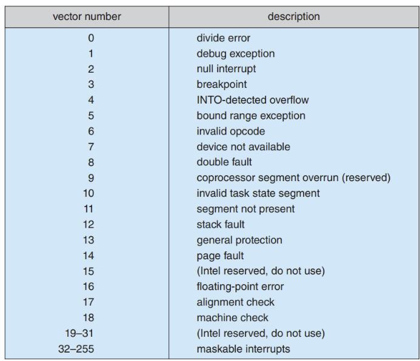
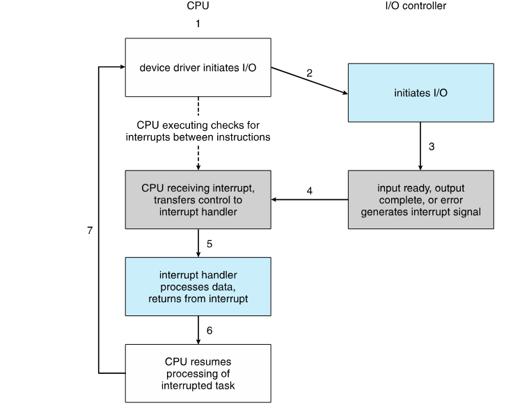

# Sodobni modeli računalnikov

Sodobni modeli računalnikov še vedno temeljijo na von Neumannovem modelu, ki vključa naslednje komponente:

- **Vhodni del**  
- **Izhodni del**  
- **Delovni ali glavni pomnilnik**  
- **Aritmetično-logična enota**  
- **Upravljalna enota**

## Vhodni del

Omogoča vnos podatkov in ukazov iz programa.

## Izhodni del

Omogoča posredovanje rezultatov izvajanja programa v okolje.

## Delovni ali glavni pomnilnik

Služi za hrambo podatkov in ukazov iz programa ter za shranjevanje rezultatov izvedenih programov.

## Aritmetično-logična enota

Izvaja aritmetične in logične operacije.

## Upravljalna enota

Prejema ukaze iz pomnilnika, jih dekodira in upravlja z aritmetično-logično enoto ter vhodnim in izhodnim delom. V sodobnih sistemih sta aritmetično-logična enota in upravljalna enota združeni v procesorju, ki vsebuje tudi registre.

---

# Vodilo

Posamezni deli računalnika so med seboj povezani preko **vodila**, ki omogoča prenos podatkov, ukazov in upravljalnih signalov.

### Lastnosti vodila

- Prenos električnih signalov poteka preko bitov.  
- Za prenos vsakega bita je potrebna ena linija vodila.  
- Skupno vodilo povezuje vse dele računalnika, kar preprečuje neposredno povezovanje vseh komponent.  
- Upravljanje vodila izvaja ločena upravljalna enota.

Vsa komunikacija poteka preko skupnega vodila, kjer se v enem trenutku izvaja le en proces (deljeni čas na vodilu).

### Časovna rezina na vodilu (ang. bus time slot)

- V eni časovni rezini, ki traja \( T_B \) sekund, se lahko izvede en proces.  
- Na primer, vodilo s časovnim razmikom \( T_B = 100 \, \text{ns} \) omogoča izvedbo 10 milijonov procesov na sekundo.

---

# Hranilni in delovni pomnilnik

Centralni del vsakega računalniškega sistema predstavlja **pomnilnik**. Pri von Neumannovem modelu se centralni pomnilnik imenuje **delovni pomnilnik**.

### Lastnosti delovnega pomnilnika

- Pri izvajanju programov morajo biti v delovnem pomnilniku shranjeni ukazi in podatki, s katerimi ti ukazi operirajo.  
- Najmanjša hranilna enota je **1 bajt (B)**, kar ustreza skupini 8 bitov.  
- Do vsake enote informacije v pomnilniku je omogočen direkten dostop.

---

# Naslovi in naslovni prostor

- Vsak bajt v pomnilniku ima svojo zaporedno številko, ki se imenuje **naslov**.  
- S pomočjo naslova dostopamo do vsakega posameznega bajta.  
- Naslovi bajtov znotraj pomnilnika so zapisani v številkah, izraženih v dvojiškem sistemu.  
- Če za zapis naslova uporabimo \( m \) bitov, lahko zapišemo \( 2^m \) različnih naslovov:
  - Velikost naslovnega prostora določamo s številom \( m \).  
  - Naslovni prostor vključuje naslove od 0 do \( 2^m - 1 \).

---

# Količina informacije in velikost naslovnega prostora

### Enote za količino informacije

- **1 B (byte)** = \( 2^3 = 8 \, \text{bitov} \)  
- **1 kB (kilobyte)** = \( 2^{10} \, \text{B} = 1024 \, \text{B} \)  
- **1 MB (megabyte)** = \( 2^{20} \, \text{B} = 1024 \, \text{kB} \)  
- **1 GB (gigabyte)** = \( 2^{30} \, \text{B} = 1024 \, \text{MB} \)  
- **1 TB (terabyte)** = \( 2^{40} \, \text{B} = 1024 \, \text{GB} \)

### Velikost naslovnega prostora

- **Za \( m = 8 \, \text{bitov} \):**  
  \[
  2^8 = 256 \, \text{B}
  \]
- **Za \( m = 16 \, \text{bitov} \):**  
  \[
  2^{16} = 64 \, \text{kB}
  \]
- **Za \( m = 32 \, \text{bitov} \):**  
  \[
  2^{32} = 4 \, \text{GB}
  \]
- **Za \( m = 64 \, \text{bitov} \):**  
  \[
  2^{64} = 16 \, \text{EB (eksabajtov)}
  \]

---

# Model preprostega računalnika

Za opisovanje osnovnih lastnosti računalnika lahko opazujemo model preprostega računalnika, ki ga sestavljata samo procesor in delovni pomnilnik.

### Predpostavke

- V delovnem pomnilniku je naložena strojna oblika programa v obliki niza ukazov, ki so shranjeni v zaporedne pomnilniške lokacije.
- V delovnem pomnilniku so shranjeni vsi vhodni podatki, ki jih program potrebuje za izvajanje.
- Program shranjuje vse rezultate izvajanja v delovni pomnilnik.

### Povezava med delovnim pomnilnikom in procesorjem

Delovni pomnilnik in procesor sta med seboj povezana preko **vodila**, ki je sestavljeno iz treh delov:

1. **Naslovni del**: vsebuje \( m \) linij.  
2. **Podatkovni del**: vsebuje \( n \) linij.  
3. **Krmilni del**: vsebuje \( k \) linij.

---

# Cikel na vodilu

Procesor je povezan na vodilo preko svojih registrov, imenovanih **medregistri**, ki omogočajo povezavo z vodilom:

- **Naslovni medregister** je povezan z naslovnim delom vodila.
- **Podatkovni medregister** omogoča dvosmerno komunikacijo: podatki se lahko prenašajo iz procesorja v pomnilnik ali obratno.

### Operacije na vodilu

- V enem ciklu na vodilu (v eni časovni rezini) se lahko izvede eno shranjevanje (STORE) ali branje vsebine iz pomnilnika (LOAD).

### Časovna omejitev

- Trajanje cikla na vodilu \( T_B \) je omejeno z materiali, ki tvorijo vodilo in čipe.
- Pri sistemih z enim vodilom vsi deli računalnika komunicirajo preko tega vodila.
- Cikli na vodilu se delijo med vse dele računalnika, kar lahko povzroči ozko grlo in omeji hitrost računalnika.

---

# STORE in LOAD pomnilniški cikel

## STORE cikel

1. Procesor postavi naslov iz naslovnega medregistra na naslovno vodilo.  
2. Procesor postavi vsebino, ki se bo shranila, na podatkovno vodilo.  
3. Procesor pošlje signal preko kontrolnega vodila, da gre za ukaz **STORE**.  
4. Pomnilnik prejme naslov v svoj naslovni register, aktivira naslovljeno pomnilniško lokacijo in shrani vsebino.

## LOAD cikel

1. Procesor postavi naslov iz svojega naslovnega medregistra na naslovno vodilo.  
2. Procesor pošlje signal preko kontrolnega vodila, da gre za ukaz **LOAD**.  
3. Pomnilnik prejme naslov z naslovnega vodila, prebere naslovljeno vsebino v svoj vsebinski register in jo prenese na podatkovno vodilo.  
4. Procesor prejme vsebino v podatkovni medregister preko podatkovnega vodila.

---

# Procesor

## Osnovne lastnosti procesorja

- Delovni pomnilnik se uporablja samo za hranjenje nizov bitov.
- Interpretacija pomena teh bitov se dogaja zunaj pomnilnika, v procesorju ali vhodno-izhodnih napravah.
- Procesor interpretira vsebino pomnilnika kot ukaze strojne kode ali osnovne podatkovne tipe.

## Struktura procesorja

Procesor v von Neumannovem modelu sestavljajo:

- **Aritmetično-logična enota**  
- **Kontrolna enota**  
- **Množica registrov**

Procesor naslavlja ukaze in podatke na različne načine:
- Ukazi se pridobivajo z naslova, na katerega kaže programski števec.
- Podatki se naslavljajo med izvajanjem ukazov, lokacija podatkov pa je določena znotraj ukazov.

### Poenostavljen model procesorja

- Razumevanje preprostega modela procesorja pomaga pri razumevanju delovanja sodobnih procesorjev, ki so veliko bolj kompleksni.
- Predpostavimo, da je velikost naslovnega in podatkovnega vodila enaka, vsi registri pa so enako veliki.
- Osnovne lastnosti in obnašanje procesorja so določeni z množico registrov ter množico ukazov, ki jih procesor lahko izvede.

---

# Registri procesorja

## Naslovni medregister

Uporablja se za naslavljanje pomnilnika ali drugih delov računalnika.

## Podatkovni medregister

Posreduje pri izmenjavi podatkov med procesorjem in drugimi deli računalnika.

## Ukazni register

Shranjuje ukaze, pridobljene iz pomnilnika. Dekodiranje ukazov izvaja kontrolna enota.

## Programski števec

Vsebuje naslov naslednjega ukaza, ki se bo izvedel. Kontrolna enota samodejno posodablja programski števec, da se ukazi izvajajo zaporedno.

## Register kazalca sklada

Omogoča shranjevanje podatkov ali ukazov v sklad.

## Register stanj

Zapisuje različne zastavice (flag), ki označujejo pravilnost ali nepravilnost pri izvajanju ukazov. Na podlagi zastavic kontrolna enota odloča o nadaljnjem izvajanju programa.

## Množica splošnih registrov

Uporabljajo se za shranjevanje operandov in rezultatov ter za pripravo naslovov za dostopanje do pomnilnika.

> Registri procesorja so med seboj povezani preko notranjih vodil, ki vključujejo tudi aritmetično-logično enoto.

---

# Kontrolna enota procesorja

## Naloge kontrolne enote

- Upravljanje celotnega delovanja procesorja.
- Dekodiranje ukazov iz ukaznega registra.
- Aktivacija notranjih vodil glede na dekodirane ukaze.
- Sporočanje aritmetično-logični enoti, katero operacijo naj izvede.
- Samodejni prehod med izvajanjem ukazov.

## Sinhronizacija delovanja

- Kontrolna enota deluje v ritmu, ki ga določa generator takta.
- Generator takta ustvarja elektronske impulze, ki sinhronizirajo vse operacije.
- V sodobnih računalnikih je takt izražen v GHz (gigahertz), kar določa hitrost procesorja.
- Višji takt pomeni hitrejše delovanje procesorja.

---

# Aritmetično-logična enota

Aritmetično-logična enota izvaja aritmetične, logične in premikalne (shift) operacije z operandi, ki jih prejme preko notranjih vodil (v našem modelu S1 in S2), rezultat pa poda na notranje vodilo S3.

## Vrste operacij

- **Aritmetične operacije:** seštevanje, odštevanje, inkrement, dekrement  
- **Logične operacije:** AND, OR, XOR, negacija  
- **Premikalne operacije:** aritmetični premik, logični premik, rotacija

## Nadzor operacij

Operacijo, ki jo izvaja aritmetično-logična enota, določa kontrolna enota, ki dekodira ukaze. Kontrolna enota določa:
- Iz katerih registrov se vzamejo operandi.
- Kam se pošlje rezultat izvedene operacije.

V skladu s tem aktivira le določene povezave na notranjih vodilih.

---

# Kako deluje procesor

## Predpostavke

- V pomnilniku imamo programsko kodo, ki je zapisana kot niz ukazov v pravilnem vrstnem redu za izvajanje.
- Ta niz ukazov, ki jih lahko procesor izvede, imenujemo **strojna programska koda**.
- V **programski števec** postavimo naslov prvega ukaza strojne kode.

## Delovanje procesorja

Procesor deluje kot avtomat, ki (ko je enkrat vklopljen) zaporedno izvaja ukaze iz strojnega programa. Postopek vključuje:

1. **Prevzem ukaza (FETCH)**
   - Pridobi iz pomnilnika ukaz, na katerega kaže programski števec.
   - Vsebina programskega števca se prenese v naslovni medregister.
   - Kontrolna enota iniciira aktivnost prenašanja ukaza iz pomnilnika.
2. **Delovanje ukaza (DECODING)**
   - Kontrolna enota dekodira ukaz in določi, katero operacijo je treba izvesti.
   - Poveča vrednost programskega števca, da kaže na naslednji ukaz.
   - Pošlje signale ALU in obvesti, katero operacijo naj se izvede.
   - Na osnovi druge množice bitov (naslovni del ukaza) določi, kateri registri so vključeni, kam shraniti rezultat in katera interna vodila aktivirati.
3. **Izvajanje operacij (EXECUTION)**
   - ALU izvede operacijo in shranjuje rezultat preko vodila \( S_3 \) v odredišče.
   - Vrednosti določenih zastavic, ki so odvisne od rezultata, se shranjujejo v register stanja (kar označuje uspešnost/neuspešnost izvedenega ukaza in se nato uporabi s strani operacijskega sistema).

---

# Faze delovanja procesorja

## Prevzem ukaza

- V prvi fazi se izvaja **prevzem ukaza (FETCH)**.
- Vsebina programskega števec se prenese v naslovni medregister.
- Kontrolna enota iniciira aktivnost prenašanja ukaza iz pomnilnika.

## Delovanje ukaza

- V drugi fazi kontrolna enota izvaja **dekodiranje ukaza (DECODING)**.
- Na osnovi množice bitov ukaza (operacijska koda) kontrolna enota ugotovi, katero operacijo je treba izvesti.
- Poveča vrednost programskega števca, da kaže na naslednji ukaz.
- Pošlje signale ALU in jo obvesti, katero operacijo je treba izvesti.
- Na osnovi druge množice bitov (naslovni del ukaza) ugotovi, katerih registrov pridejo operandi, kam je treba shraniti rezultat in katera interna vodila aktivirati.

## Izvajanje operacij

- V tretji fazi se izvajajo operacije v ALU (**EXECUTION**).
- ALU izvede operacijo in shrani rezultat preko vodila \( S_3 \) v odredišče.
- Vrednosti določenih zastavic, ki so odvisne od rezultata, se shranjujejo v register stanja:
  - S tem označimo uspešnost/neuspešnost izvedenega ukaza.
  - Ta informacija se nato uporabi s strani operacijskega sistema.

## Organizacija sodobnega računalniškega sistema

### Sodobni računalniški sistemi

Sodobni računalniški sistemi vključujejo tudi številčne vhodno/izhodne enote (V/I) poleg dosedanjih komponent Von Neumannovega modela: pomnilnik, procesor in vodilo.

### Centralne procesorske enote in krmilniki naprav

- Ena ali več centralnih procesorskih enot (CPE) ter krmilniki naprav (device controllers) so povezani prek skupnega vodila (bus) in imajo s tem dostop do deljenega pomnilnika (shared memory).  
- CPE premikajo podatke iz glavnega pomnilnika (ali v glavni pomnilnik) v lokalne medpomnilnike (ali iz lokalnih medpomnilnikov).

### Naloga krmilnikov naprav

- Vsak krmilnik naprave je odgovoren predvsem za eno vrsto naprav.
  - Ima svoj lokalni medpomnilnik (local buffer) in nekaj registrov z določeno funkcijo.
  - Odgovoren je za prenos podatkov iz V/I naprav do medpomnilnika.

---

## Izvajanje V/I operacij in prekinitev

### Začetek V/I operacij

- Gonilnik naprave najprej naloži vsebino v register krmilnika naprave.

### Preverjanje in določanje nalog

- Hkrati krmilnik preveri vsebino registrov in določi, katero nalogo mora izvesti (npr. prebrati znak iz tipkovnice).

### Proces prenosa podatkov

- Vhod/izhod podatkov se generira neposredno na napravi v lokalnem medpomnilniku krmilnika naprave.
- Krmilnik naprave obvesti gonilnik naprave, ko zaključi prenos podatkov.

### Obveščanje z interrupcijami

- Obveščanje poteka s pomočjo prekinitve (interrupt).
- Prekinitve so eden najpomembnejših mehanizmov za delovanje računalniškega sistema.

---

## Časovni potek prekinitve

---

## Prekinitev v računalniškem sistemu

### Strojna oprema in prekinitev

- Strojna oprema lahko pošlje prekinitev kadarkoli:
  - To se izvede s pomočjo električnega signala prek sistemskega vodila.
  - S tem se obvesti CPE ali katera druga naprava.

### Programsko generirane prekinitve

- Izjema (trap ali exception) je prekinitev, ki jo ustvari programska oprema (software-generated interrupt) in je povzročena zaradi napake ali zahteve uporabnika.
- Operacijski sistem temelji na principu prekinitev (interrupt-driven).

---

## Prekinitveni vektor

### Prenos kontrole na prekinitev

- Ko je delovanje CPE prekinjeno, se kontrola prenese na modul za prekinitev (interrupt service routine).
- To se izvede s pomočjo prekinitvenega vektorja (interrupt vector), ki vsebuje začetne naslove (v pomnilniku) vseh servisnih rutin.
  - Servisne rutine so programi, ki se izvedejo, ko nastane prekinitev.

### Vrnitev kontrole

- Po koncu izvajanja se kontrola vrne CPE, ki nadaljuje z izvajanjem prekinjenega programa.
  - Za ta namen mora prekinjevalni sistem shraniti naslov prekinjenega ukaza (interrupted instruction).

---

## Implementacija prekinitev znotraj računalniškega sistema

### Interrupt request linija

- Strojna oprema CPE ima linijo za oddajanje zahtevkov za prekinitev (interrupt request line).
- CPE preverja to linijo po vsakem izvedenem ukazu.

### Postopek ob prejemu prekinitve

Ko CPE zazna, da je krmilnik oddal signal prek prekinjevalne linije:
- Prebere številko prekinitve.
- Skoči na servisni prekinjevalni program (interrupt-handling routine), ki se nahaja v pomnilniku.
- Različni segmenti programske kode določajo, katera dejanja je treba izvesti za vsako vrsto prekinitve.
- Nato začne izvajati prekinjevalni program.

### Nadzornik prekinitve (Interrupt Handler)

- **Shranjevanje stanja:** Operacijski sistem ohrani stanje CPE s shranjevanjem stanja registrov in programskega števca (program counter).
- **Ugotavljanje vzroka prekinitve:** 
  - Pripravljenost vhodno/izhodne naprave (polling interrupt).
  - Vektorske prekinitve (vectored interrupt).
- **Izvedba prekinitve:** Izvede ustrezno rutino prekinitve.
- **Vrnitev v prvotno stanje:** Poskrbi, da se CPE vrne v stanje pred prekinitvijo.

